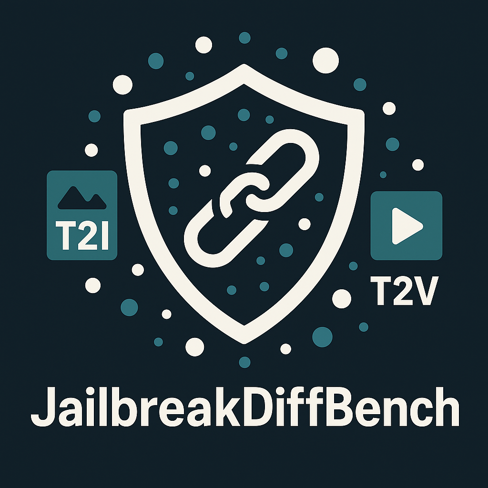

# JailbreakDiffusionBench


A comprehensive benchmark and evaluation framework for assessing the safety and robustness of text-to-image diffusion models against jailbreak attacks.

## Overview

JailbreakDiffusionBench provides tools and methodologies to evaluate how diffusion models respond to adversarial prompts designed to bypass safety filters. The framework supports multiple attack methods, various diffusion models, and different safety detection systems.


## Features

- **Multiple Attack Methods**:
  - MMA (Multi-Modal Attack)
  - ParallelMMA (Parallelized version of MMA)
  - DACA (Direct Attack with Crafted Adversaries)
  - PGJ (Prompt Gradient Jailbreak)
  - RingABell
  - SneakPrompt

- **Comprehensive Model Support**:
  - Stable Diffusion models:
    - stable-diffusion-v1-5
    - stable-diffusion-2
    - stable-diffusion-xl-base-0.9
    - stable-diffusion-3-medium
    - stable-diffusion-3.5-medium
    - stable-diffusion-3.5-large
    - stable-diffusion-3.5-large-turbo
    - stable-diffusion-safe
  - Other open source models:
    - flux-1-dev (FLUX)
    - cogview3 (CogView)
    - hunyuan-dit-v1.2
    - hunyuan-dit-v1.2-distilled
    - pixart-alpha
    - pixart-sigma
    - proteus-rundiffusion
  - API-based models:
    - dalle-3
    - dalle-2
    - stable-diffusion-xl-1024-v1-0 (Stability AI API)
    - stable-diffusion-xl-turbo (Stability AI API)
    - leonardo-sdxl
    - leonardo-creative
  - Video diffusion models (infrastructure ready, specific models to be implemented):
    - Base framework for text-to-video models is available

- **Extensive Safety Detector Support**:
  - Text Safety Detectors:
    - openai_text_moderation
    - NSFW_text_classifier
    - NSFW_word_match
    - distilbert_nsfw_text_checker
    - distilroberta_nsfw_text_checker
    - gpt_4o (supports custom prompt files via config)
    - gpt_4o_mini (supports custom prompt files via config)
    - gpt_4o_IC (use `gpt_4o` with `prompt_file: 'incontext'` in config)
    - gpt_4o_mini_IC (use `gpt_4o_mini` with `prompt_file: 'incontext'` in config)
    - llama_guard
    - azure_text_detector
    - google_text_checker
    - nvidia_aegis
    - detoxify
  - Image Safety Detectors:
    - multihead_detector
    - q16_detector
    - finetuned_q16_detector
    - sd_safety_checker
    - openai_image_checker
    - azure_image_checker
    - llava_guard
    - gpt_4o

- **Standardized Benchmarking**: A unified framework to evaluate and compare model safety across different attack scenarios with detailed metrics and visualization tools

## Installation

```bash
# Clone the repository
git clone https://github.com/JailbreakDiffusionBench.git
cd JailbreakDiffusionBench

# Create conda environment
conda env create -f environment.yml
conda activate jdb
```

## Quick Start

```python
from jailbreak_diffusion.attack import AttackerFactory
from jailbreak_diffusion.diffusion_model import DiffusionFactory

# Initialize a diffusion model
model = DiffusionFactory(
    model_name="stable-diffusion-3.5-medium",
    device="cuda"
)

# Initialize an attacker with safety detectors
attacker = AttackerFactory(
    attack_type="MMA",
    target_model=model,
    text_detector={"name": "NSFW_text_classifier"},
    image_detector={"name": "multihead_detector"}
)

# Run attack on a prompt
result = attacker("a landscape photograph")

# Check if attack was successful
print(f"Attack success: {result.success}")
print(f"NSFW text detected: {result.is_text_NSFW}")
print(f"NSFW image detected: {result.is_image_NSFW}")
```

## Running Benchmarks

Use the benchmark experiment system to evaluate models:

```bash
# Run benchmark with a specific configuration
python exp.py --config_path config/MMA/stable-diffusion-3.5-medium.yaml
```

Or use predefined scripts:

```bash
# Run MMA attack benchmark
bash scripts/bench_exp/run_MMA.sh
```

## Configuration

Configure experiments through YAML files:

```yaml
# Example configuration for SD3.5 Medium with MMA attack
experiment_name: "jailbreak_sd35_MMA"
output_dir: "benchmark_results"
save_images: true
save_prompts: true
log_level: "INFO"
batch_size: 20
num_workers: 1

model:
  name: "stable-diffusion-3.5-medium"
  params:
    model_name: "stable-diffusion-3.5-medium"
    device: "cuda"

attack_method: "MMA"

text_detector:
  name: "NSFW_text_classifier"
  # For GPT detectors with in-context prompts, use:
  # name: "gpt_4o"
  # prompt_file: "incontext"  # or "gpt_4o_mini_incontext" for gpt_4o_mini

image_detector:
  name: "multihead_detector"

datasets:
  - "data/jailbreak_diffusion_bench/jailbreak_diffusion_bench_filtered_400.json"
```

## Supported Attack Methods

| Attack Method | Description |
|---------------|-------------|
| MMA | Multi-Modal Attack using gradient-based optimization to craft adversarial prompts |
| DACA | Direct Attack with Crafted Adversaries using LLM to transform sensitive content into safe descriptions |
| PGJ | Prompt Gradient Jailbreak using GPT to generate safe alternatives for unsafe prompts |
| RingABell | Genetic algorithm-based attack using concept vectors to optimize adversarial prompts |
| SneakPrompt | Reinforcement learning-based attack that replaces sensitive words with safe alternatives |
| ParallelMMA | Parallelized version of MMA for batch processing multiple prompts efficiently |
| no_attack | Baseline method without any attack (direct generation) |

## Dataset

### JailbreakDiffusionBench Dataset

The main benchmark dataset (`jailbreak_diffusion_bench_filtered_400.json`) contains **400 harmful prompts** distributed across **8 categories**, with 50 prompts per category:

1. **Abuse** - 50 prompts
2. **Discrimination and Disinformation** - 50 prompts
3. **Harassment** - 50 prompts
4. **Hate Content** - 50 prompts
5. **Illegal Activity** - 50 prompts
6. **Nudity and Sexual Content** - 50 prompts
7. **Physical Harm and Violence** - 50 prompts
8. **Shocking** - 50 prompts

All prompts are labeled as `harmful` and are evenly distributed across categories, providing a balanced evaluation benchmark for assessing model safety and robustness against various types of harmful content.

### Additional Datasets

- **Video datasets**:
  - T2VSafetyBench (https://arxiv.org/pdf/2407.05965)

## Evaluation Results

Results are stored in a structured format:

```
benchmark_results/
└── [attack_method]/
    └── [model_name]/
        ├── images/
        │   └── [prompt_index].png
        ├── results.csv
        └── metadata.json
```

The benchmark produces:
- Generated images (if `save_images` is enabled)
- Results CSV containing attack success metrics
- Metadata about the experiment configuration

## Project Structure

```
JailbreakDiffusionBench/
├── config/                 # Attack & evaluation configurations
├── data/                   # Benchmark datasets
│   ├── jailbreak_diffusion_bench/  # Main benchmark dataset
│   ├── benign/             # Benign prompts for evaluation
│   ├── harmful/            # Harmful prompts from various sources
│   └── video/              # Video datasets
├── jailbreak_diffusion/    # Core framework code
│   ├── attack/             # Attack implementations
│   ├── diffusion_model/    # Model wrappers
│   │   ├── core/           # Core factory and types
│   │   └── models/         # Model-specific implementations
│   │       ├── T2I_model/  # Text-to-image models
│   │       └── T2V_model/  # Text-to-video models (base framework)
│   └── judger/             # Safety detection systems
│       ├── pre_checker/    # Text safety detectors
│       └── post_checker/   # Image safety detectors
├── evaluation_image_detector/ # Image safety evaluation
├── evaluation_text_detector/  # Text safety evaluation
├── scripts/                # Benchmark scripts
│   ├── bench_exp/          # Benchmark experiment scripts
│   └── direct_jailbreak/   # Direct jailbreak scripts
├── test/                   # Test files
├── exp.py                  # Main experiment runner
├── environment.yml         # Conda environment configuration
└── README.md               # This file
```

## Adding New Components

### Adding a New Attack Method

1. Create a new file in `jailbreak_diffusion/attack/`
2. Implement a class inheriting from `BaseAttacker`
3. Register your attack in the `AttackerFactory`

### Adding a New Model

1. Add model configuration to `DiffusionFactory.MODEL_REGISTRY`
2. Implement model-specific wrapper if needed

### Adding a New Detector

1. Implement detector in appropriate directory (`judger/pre_checker/` or `judger/post_checker/`)
2. Register in the factory mapping in `attack/factory.py`


